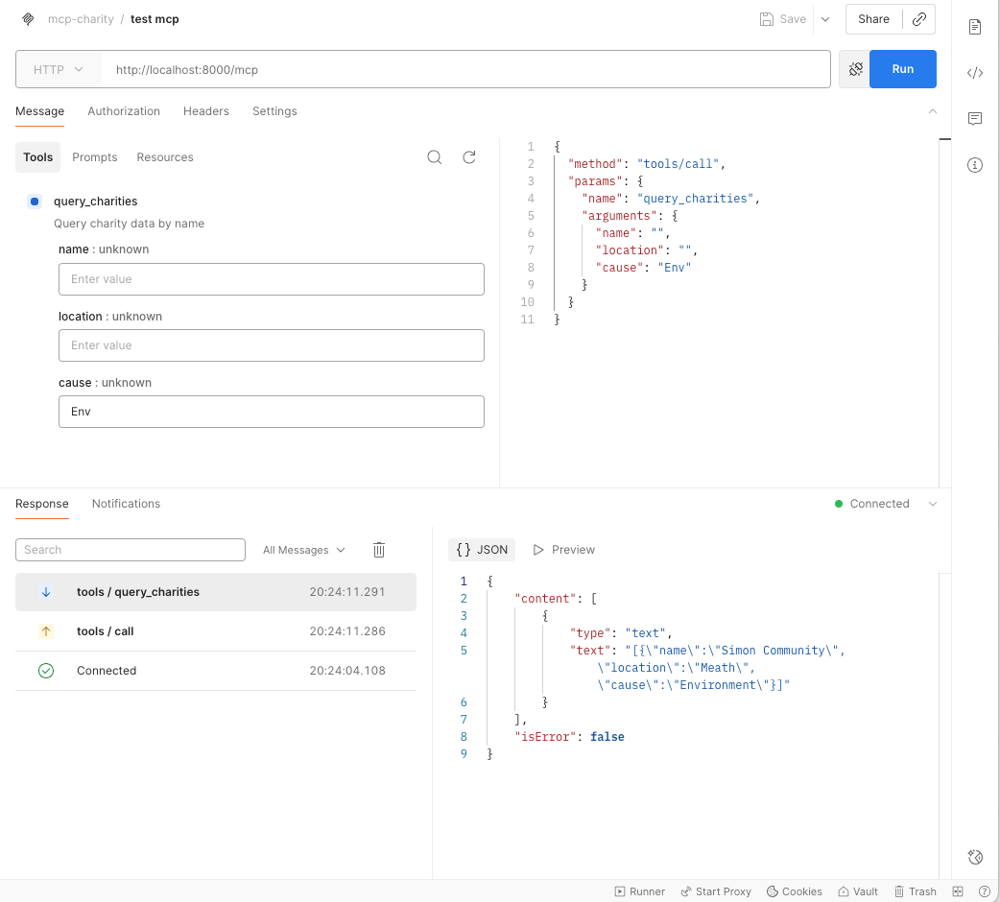

# mcp-charity

### Install Dependencies
```shell
pip install -r requirements.txt
```

### Start MCP Server with `FASTMCP` (`transport=STDIO`, for CLI interface instead of HTTP / Postman)
```shell
fastmcp run charity_server.py
```

### Start MCP Server for Testing with recommended python init main process
```shell
python3 charity_server.py
```
### Test via CLI with curl (__Note:__ Allows for sub string search values - `direct match not required!`)
```shell
curl --request POST \
  --url http://localhost:8000/mcp \
  --header 'accept: application/json, text/event-stream' \
  --header 'content-type: application/json' \
  --header 'mcp-session-id: my-test-session-124' \
  --data '{ "method": "tools/call", 
  "params": { "name": "query_charities", 
      "arguments": { 
          "charity_name": "", 
          "location": "Gal", 
          "cause": "" 
      } 
  }, 
  "jsonrpc": "2.0", 
  "id": 9}'
```
### Response from curl
```shell
event: message
data: {
  "jsonrpc":"2.0",
  "id":9,
  "result":{
    "content":[{
        "type":"text",
        "text":"[{
          \"name\":\"Irish Cancer Society\",
          \"location\":\"Galway\",
          \"cause\":\"Health\"}]"
    }],
  "isError":false
  }
}
```

### Use `Postman` to connect & tests available app tools / end-points


### HTTP Endpoint
 - http://localhost:8000/mcp

### Request Body for POST request to `query_charities` tool
```shell
curl --request POST \
  --url http://localhost:8000/mcp \
  --header 'accept: application/json, text/event-stream' \
  --header 'content-type: application/json' \
  --header 'mcp-session-id: my-test-session-124' \
  --data '{ "method": "tools/call", 
  "params": { "name": "query_charities", 
      "arguments": { 
          "charity_name": "", 
          "location": "", 
          "cause": "Animals" 
      } 
  }, 
  "jsonrpc": "2.0", 
  "id": 9}'
```
### Curl Response
```shell
event: message
data: {"jsonrpc":"2.0","id":9,"result":{"content":[{"type":"text","text":"[{\"name\":\"Dogs Trust\",\"location\":\"Dublin\",\"cause\":\"Animals\"}]"}],"isError":false}}
```

### Postman Response Body (Formatted)
```json
{
    "content": [
        {
            "type": "text",
            "text": "[{\"name\":\"Dogs Trust\",\"location\":\"Dublin\",\"cause\":\"Animals\"}]"
        }
    ],
    "isError": false
}
```
